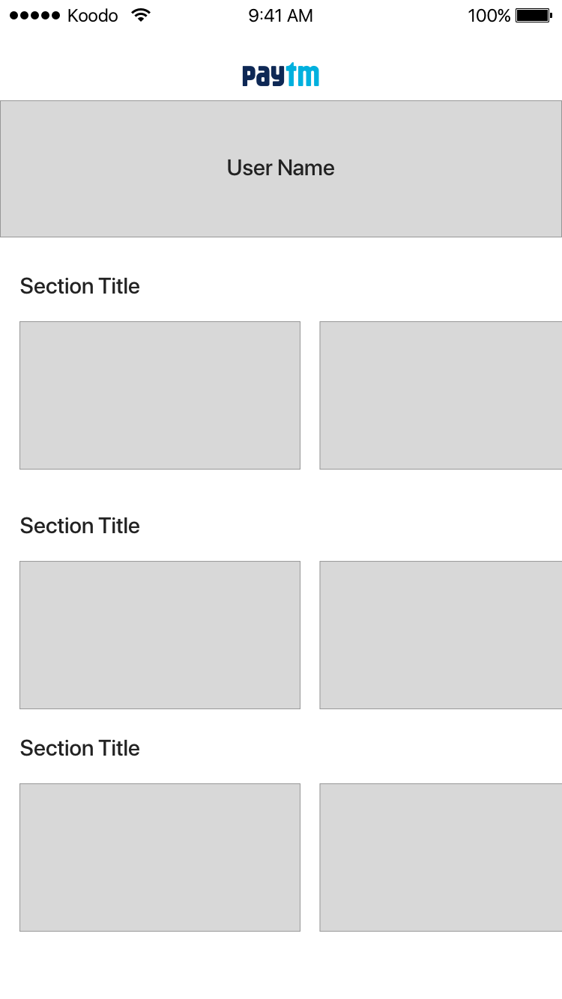

#Mobile App Developer Coding Challenge

## Goal:

#### Develop an app that allows a user to see their albums and its' associated photographs

- [ ] Fork this repo. Keep it public until we have been able to review it.
- [ ] Android: _Java/Kotlin_ | iOS: _Swift_
- [ ] Albums/Phtos must be fetched from: https://jsonplaceholder.typicode.com/
- [ ] Albums should be persisted locally and updated when new data available
- [ ] App should allow to switch user

### Evaluation:
- [ ] App operates as asked
- [ ] No crashes or bugs
- [ ] SOLID principles
- [ ] Code is understandable and maintainable

Suggestion: 
- Input field with a drop-down user selection.
- /users to fetch the users
- /albums to fetch the albums
- /photos associated with albums

